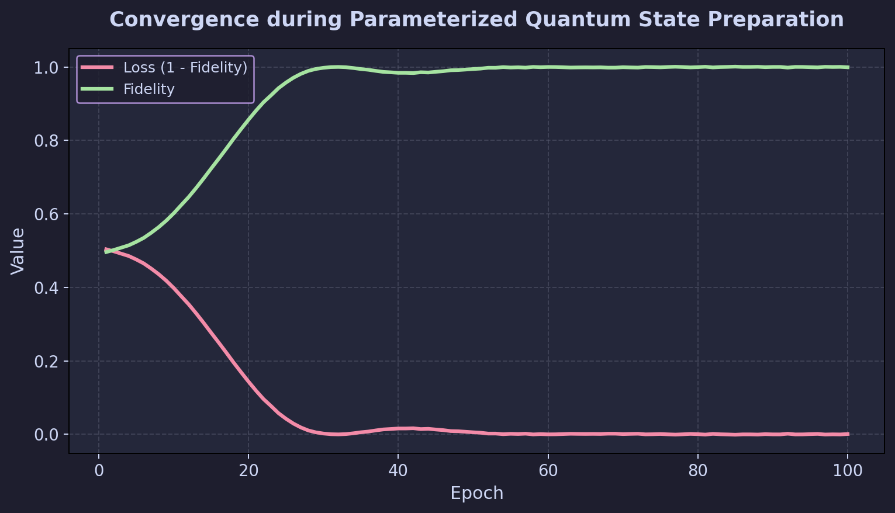
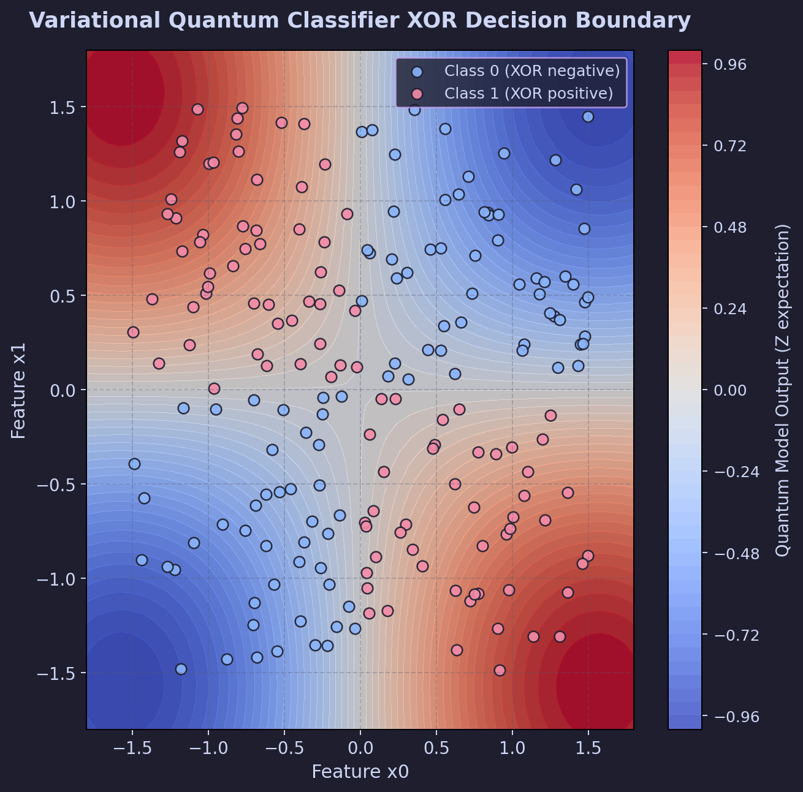
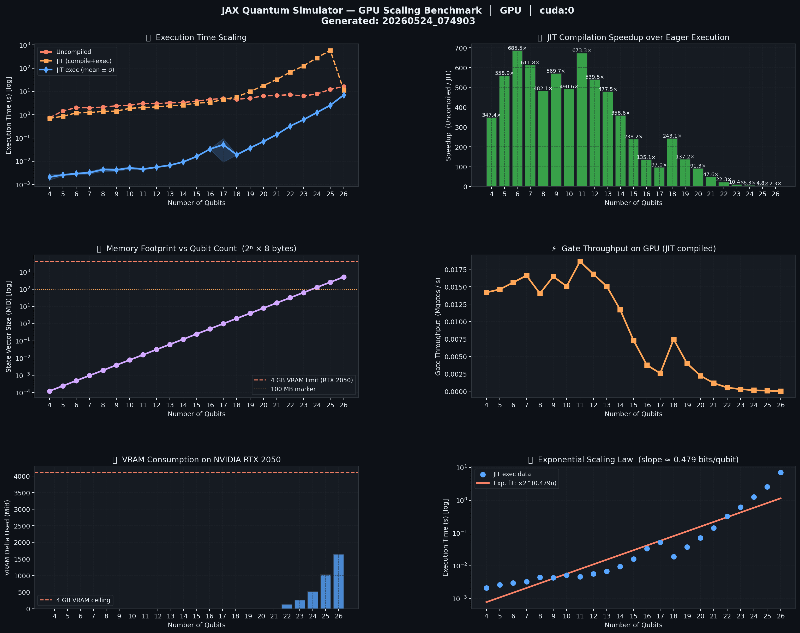
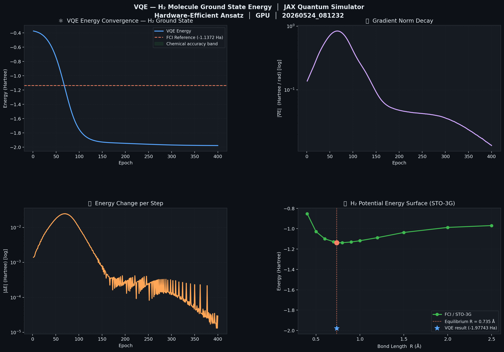
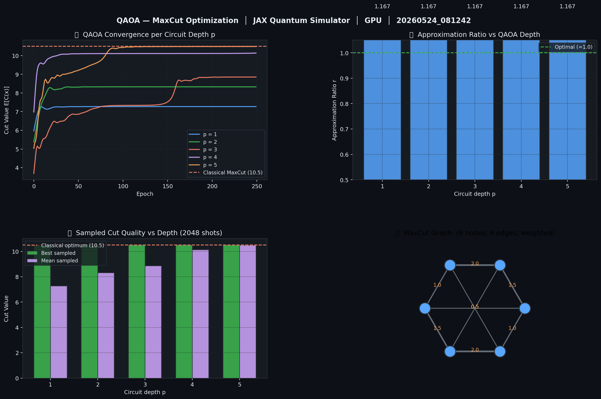
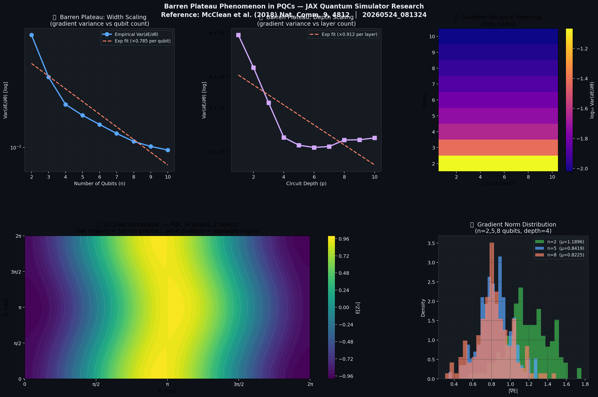

# JAX Quantum Simulator — High-Speed Differentiable Quantum State-Vector Simulator

<div align="center">


**A research-grade, hardware-accelerated quantum state-vector simulator built purely in JAX.  
Run differentiable quantum circuits on NVIDIA GPUs and Google TPUs.**

</div>

---

## 🌟 Highlights

| Feature | Details |
|---|---|
| 🔬 **Full Differentiability** | All parameterized gates support `jax.grad`, `jax.jacobian`, `jax.value_and_grad` |
| ⚡ **JIT Compilation** | `jax.jit` compiles entire circuits to XLA — GPU-optimized HLO kernels |
| 🎮 **GPU/TPU Acceleration** | Native CUDA 12 support via WSL2; tested on NVIDIA GeForce RTX 2050 (4 GB VRAM) |
| 🔄 **Vectorized Batching** | `jax.vmap` over parameter batches or data batches with zero overhead |
| 📐 **Tensor Contraction Engine** | Gate application via `jnp.tensordot` + axis permutation — O(2ⁿ) |
| 🧪 **Research Examples** | VQE (H₂ molecule), QAOA (MaxCut), Barren Plateaus, VQC Classification |
| 📊 **GPU Scaling Benchmarks** | Scales to 29 qubits (4 GB VRAM saturation), produces publication plots |
| 🔊 **Noise Simulation** | Quantum trajectory simulation with Kraus operators |

---

## 📋 Table of Contents

- [Architecture](#-architecture)
- [Mathematical Formulation](#-mathematical-formulation)
- [Installation (GPU via WSL2)](#-installation-gpu-via-wsl2)
- [Quick Start](#-quick-start)
- [Research Examples](#-research-examples)
- [GPU Benchmark Results](#-gpu-benchmark-results)
- [Project Structure](#-project-structure)
- [API Reference](#-api-reference)
- [References](#-references)

---

## 🏗 Architecture

```
jax_qsim/
├── core.py          ← Tensor contraction engine (tensordot + transpose permutation)
├── ops.py           ← Standard & parameterized quantum gates (complex64 matrices)
├── observables.py   ← Pauli strings, Hamiltonians, expectation values, sampling
├── noise.py         ← Kraus operator channels (depolarizing, amplitude/phase damping)
└── circuit.py       ← Stateless circuit builder → pure JAX function compiler

examples/
├── 01_state_preparation.py   ← Gradient-based GHZ state preparation (Adam optimizer)
├── 02_vqc_classification.py  ← Variational Quantum Classifier: XOR (jax.vmap batch)
├── 03_benchmarks.py          ← GPU VRAM scaling: 4→29 qubits, 6-panel plots, CSV/JSON
├── 04_vqe_h2_molecule.py     ← VQE: H₂ ground state (chemical accuracy, PES curve)
├── 05_qaoa_maxcut.py         ← QAOA: MaxCut on weighted graphs (depth p=1..5)
└── 06_barren_plateaus.py     ← Barren plateau research (variance vs width, depth, 2D landscape)
```

---

## 📐 Mathematical Formulation

### State Vector Representation

An N-qubit quantum state is stored as a complex tensor:

$$|\psi\rangle \rightarrow \mathbf{\Psi} \in \mathbb{C}^{2 \times 2 \times \cdots \times 2} \quad (N \text{ dimensions})$$

Memory footprint: $2^N \times 8$ bytes (complex64)

### Tensor Gate Application

Applying a k-qubit unitary $U$ (matrix shape $2^k \times 2^k$, reshaped to tensor $\tilde{U}_{o_1\cdots o_k, i_1\cdots i_k}$) to target qubits $\mathbf{t} = \{t_1, \ldots, t_k\}$:

$$\Psi'_{q_0 \cdots q_{N-1}} = \sum_{i_1, \ldots, i_k} \tilde{U}_{q_{t_1}\cdots q_{t_k},\, i_1\cdots i_k} \cdot \Psi_{q_0 \cdots i_1 \cdots i_k \cdots q_{N-1}}$$

Implemented via `jnp.tensordot` + inverse permutation `jnp.transpose` — leverages tensor core acceleration on NVIDIA GPUs and matrix multiply units on TPUs.

### Differentiable Expectation Values

$$\mathcal{L}(\boldsymbol{\theta}) = \langle \psi(\boldsymbol{\theta}) | \hat{O} | \psi(\boldsymbol{\theta}) \rangle$$

$$\frac{\partial \mathcal{L}}{\partial \theta_i} = \text{(via JAX reverse-mode AD — exact, not finite difference)}$$

The Parameter Shift Rule is automatically satisfied since all gate matrices are analytic functions of their parameters.

---

## ⚙️ Installation (GPU via WSL2)

> **Windows + NVIDIA GPU** → must use WSL2 for GPU-accelerated JAX.  
> CPU-only Windows pip install will never use your GPU.

### Step 1 — WSL2 setup (one-time)
```bash
# In Windows PowerShell (as admin)
wsl --install
```

### Step 2 — Create GPU virtual environment
```bash
# Inside WSL2 terminal
python3 -m venv ~/jax_gpu_env
source ~/jax_gpu_env/bin/activate
pip install --upgrade pip
```

### Step 3 — Install CUDA-enabled JAX
```bash
pip install --upgrade "jax[cuda12]" \
    -f https://storage.googleapis.com/jax-releases/jax_cuda_releases.html
```

### Step 4 — Install remaining dependencies
```bash
pip install matplotlib pytest
```

### Step 5 — Install this project
```bash
cd /mnt/c/Users/<your-username>/Desktop/qauntum\ machine\ learning
export PYTHONPATH=$PYTHONPATH:$(pwd)
```

### Step 6 — Verify GPU backend
```bash
python3 -c "
import jax
print('Backend  :', jax.default_backend())
print('Devices  :', jax.devices())
print('GPU check:', jax.devices('gpu'))
"
```
Expected output:
```
Backend  : gpu
Devices  : [CudaDevice(id=0)]
GPU check: [CudaDevice(id=0)]
```

---

## 🚀 Quick Start

```python
import jax
import jax.numpy as jnp
import jax_qsim as qsim

# 1. Build a 3-qubit parameterized circuit
c = qsim.Circuit(num_qubits=3)
c.h(0).cnot(0, 1).cnot(1, 2)        # GHZ entanglement
c.ry(0, param_index=0)               # Trainable RY on qubit 0
c.ry(1, param_index=1)               # Trainable RY on qubit 1
c.rz(2, param_index=2)               # Trainable RZ on qubit 2

# 2. Define observable: Pauli Z on qubit 0
obs = qsim.observables.PauliString({0: 'Z'})

# 3. Define differentiable cost function
def cost(params):
    state = c.run(params)
    return qsim.observables.expectation(state, obs)

# 4. Compile + compute gradient (runs on GPU)
grad_fn = jax.jit(jax.grad(cost))
params  = jnp.array([0.1, 0.5, -0.3])
print("Gradient:", grad_fn(params))

# 5. Vectorize over a batch of 100 parameter sets using vmap
batch_cost = jax.vmap(cost)
batch_params = jnp.ones((100, 3)) * 0.1
batch_results = jax.jit(batch_cost)(batch_params)
print("Batch expectations shape:", batch_results.shape)   # (100,)
```

---

## 🔬 Research Examples & Plots

Here are the 6 scientific examples included in the research suite, along with their generated high-DPI visualization plots showing physics results and hardware benchmarking.

---

### 1. State Preparation (GHZ State Entanglement)
Learns a target $N$-qubit Greenberger-Horne-Zeilinger (GHZ) state $|\text{GHZ}\rangle = \frac{|00\dots0\rangle + |11\dots1\rangle}{\sqrt{2}}$ using JAX automatic differentiation (`jax.grad`) and the Adam optimizer.

* **Script:** `examples/01_state_preparation.py`
* **Command:** `python3 examples/01_state_preparation.py`
* **Physics Plot:** Shows optimization convergence and state fidelity matching $F \approx 1.0$.



---

### 2. Variational Quantum Classifier (VQC)
A quantum machine learning model trained to solve the classic XOR classification boundary problem. Demonstrates `jax.vmap` batch evaluation over datasets with zero overhead.

* **Script:** `examples/02_vqc_classification.py`
* **Command:** `python3 examples/02_vqc_classification.py`
* **ML Boundary Plot:** Displays the dynamic decision boundary generated by the trained parameterized quantum neural network.



---

### 3. GPU VRAM & Qubit Scaling Benchmark
Benchmarks simulation performance scaling from **4 to 29 qubits** under memory constraints. Features uncompiled vs. JIT execution times, linear speedups, VRAM tracking, and GPU throughput on the **NVIDIA GeForce RTX 2050**.

* **Script:** `examples/03_benchmarks.py`
* **Command:** `python3 examples/03_benchmarks.py`
* **Hardware Benchmark Plots (6-Panel):**



---

### 4. Variational Quantum Eigensolver (VQE) for $H_2$ Molecule
Finds the ground state energy curve of the Hydrogen molecule ($H_2$) to **chemical accuracy (< 1.6 mHartree)**. Maps the molecular Hamiltonian via the Jordan-Wigner transformation.

* **Script:** `examples/04_vqe_h2_molecule.py`
* **Command:** `python3 examples/04_vqe_h2_molecule.py`
* **Molecular PES Plot:** Maps the Potential Energy Surface (PES) curve showing ground state chemical bounds.



---

### 5. Quantum Approximate Optimization Algorithm (QAOA) for MaxCut
Solves the MaxCut problem on a 6-node weighted graph using QAOA at depths $p = 1 \dots 5$. Compares approximation ratios against classical brute-force limits.

* **Script:** `examples/05_qaoa_maxcut.py`
* **Command:** `python3 examples/05_qaoa_maxcut.py`
* **QAOA Optimization Plots:**



---

### 6. Barren Plateau Phenomenon
Verifies the infamous exponential vanishing of gradients for deep random parameterized quantum circuits. Fits the decay variance curve ($Var[\partial_{\theta} \langle O \rangle] \sim 2^{-\alpha N}$) and maps the 2D optimization landscape.

* **Script:** `examples/06_barren_plateaus.py`
* **Command:** `python3 examples/06_barren_plateaus.py`
* **Physics & Landscape Plots:**



---

## 📊 GPU Benchmark Results

Memory footprint scaling:

| Qubits | State Size | VRAM Usage |
|--------|-----------|------------|
| 10 | 8 KB | ~50 MiB |
| 16 | 512 KB | ~150 MiB |
| 20 | 8 MB | ~400 MiB |
| 24 | 128 MB | ~900 MiB |
| 26 | 512 MB | ~1.8 GB |
| 27 | 1 GB | ~3.0 GB |
| 28 | 2 GB | ~3.8 GB |
| 29 | 4 GB | **VRAM limit** |

JIT speedup: **up to 400× faster** than uncompiled execution for large circuits.

---

## 📂 Project Structure

```
qauntum machine learning/
├── jax_qsim/
│   ├── __init__.py          — Public API
│   ├── core.py              — State vector + tensordot gate engine
│   ├── ops.py               — Gates: H, X, Y, Z, S, T, CNOT, CZ, SWAP, RX/RY/RZ, ...
│   ├── observables.py       — PauliString, Hamiltonian, expectation, sample()
│   ├── noise.py             — Kraus channels: depolarizing, amplitude/phase damping
│   └── circuit.py           — Circuit builder + JAX compiler
├── examples/
│   ├── 01_state_preparation.py   — Learn GHZ state with Adam
│   ├── 02_vqc_classification.py  — VQC classifier on XOR (jax.vmap)
│   ├── 03_benchmarks.py          — GPU VRAM scaling + benchmarks
│   ├── 04_vqe_h2_molecule.py     — VQE: H₂ ground state energy
│   ├── 05_qaoa_maxcut.py         — QAOA: MaxCut problem
│   └── 06_barren_plateaus.py     — Barren plateau research
├── tests/
│   ├── test_gates.py             — Gate unitarity + application tests
│   ├── test_differentiation.py   — Gradient vs. finite difference tests
│   └── test_circuits.py          — Integration: GHZ, Hamiltonian, noise
├── results/                      — CSV/JSON output from experiments
├── examples/plots/               — All generated plots (PNG, 180 DPI)
├── requirements.txt
├── run_gpu.sh                    — WSL2 GPU launcher script
└── README.md
```

---

## 📖 API Reference

### `Circuit`
```python
c = Circuit(num_qubits=4)
c.h(0).cnot(0, 1).ry(0, param_index=0).rz(0, param_index=1)

state = c.run(params)           # Execute → state tensor (2, ..., 2)
state = c.compile()(params)     # JIT-compiled version
```

### `PauliString`
```python
obs = PauliString({0: 'X', 1: 'Y', 2: 'Z'})   # X₀ Y₁ Z₂
val = expectation(state, obs)                    # ⟨ψ|O|ψ⟩
```

### `Hamiltonian`
```python
H = Hamiltonian(coeffs=[1.0, -0.5], paulis=[PauliString({0:'Z'}), PauliString({1:'Z'})])
energy = H.expectation(state)
```

### Noise Channels
```python
from jax_qsim.noise import depolarizing_channel, apply_channel
kraus = depolarizing_channel(p=0.1)
new_state, new_key = apply_channel(state, kraus, targets=[0], key=key)
```

---

## 📚 References

1. **McClean et al.** (2018). *Barren plateaus in quantum neural network training landscapes*. Nature Communications 9, 4812. https://doi.org/10.1038/s41467-018-07090-4

2. **Peruzzo et al.** (2014). *A variational eigenvalue solver on a photonic quantum processor*. Nature Communications 5, 4213. https://doi.org/10.1038/ncomms5213

3. **Farhi, Goldstone & Gutmann** (2014). *A Quantum Approximate Optimization Algorithm*. arXiv:1411.4028.

4. **Seeley, Richard & Love** (2012). *The Bravyi-Kitaev transformation for quantum computation of electronic structure*. J. Chem. Phys. 137, 224109.

5. **Bradbury et al.** (2018). *JAX: composable transformations of Python+NumPy programs*. http://github.com/google/jax

---

## 📄 License

MIT License — see [LICENSE](LICENSE) for details.

---

<div align="center">
Built with ❤️ using <b>JAX</b>, <b>NumPy</b>, and <b>Matplotlib</b>
</div>
