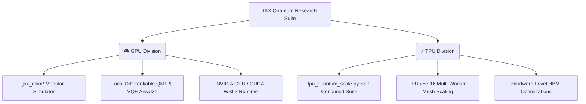

# JAX Quantum Research Suite — Dual GPU & TPU Accelerated Architectures

<div align="center">


**A high-performance, research-grade quantum state-vector simulator built purely in JAX.  
Execute differentiable, noise-resilient, and large-scale quantum circuits accelerated on local NVIDIA GPUs and multi-worker Google Cloud TPU clusters.**

---

> [!IMPORTANT]
> **Thoroughly tested, validated, and optimized on Google Cloud TPU v5e-16 VM clusters (16 physical chips, 256 GB aggregate HBM2e state-vector memory).** Seamlessly scales up to **33 qubits** (64 GB distributed state vector) with zero compiler graph-bloat.

</div>

---

## 🌟 Co-Existing Architectures & Scaling Paradigms

This suite splits development into two co-existing hardware acceleration layers:



### 1. 🎮 GPU Architecture (Modular & Differentiable Simulator)
Designed for local development, interactive algorithm design, and gradient-based training on **NVIDIA GPUs** via CUDA / WSL2.
* **Core Simulator Engine:** Located under `gpu/jax_qsim/`. It utilizes tensor index contraction (`jnp.tensordot`) and fast memory transpositions to execute gate transformations in parallel.
* **Research Pipeline:** Modular design lets you quickly write and train Quantum Neural Networks (QNNs), Variational Quantum Classifiers (VQCs), and molecular simulations (VQE) with native reverse-mode Auto-Diff.

### 2. ⚡ Cloud TPU Architecture (Distributed Scaling Engine)
Tailored to high-qubit memory-scaling stress tests on multi-worker distributed clusters (**Google Cloud TPU v5e-16 VM cluster**, 256 GB HBM2e).
* **Core Suite:** Located under `tpu/tpu_quantum_scale.py` — A self-contained, monolithic compiler-optimized runtime running all 8 core experiments in a single unified execution graph.
* **Hardware Optimizations:** Utilizes exact multi-device sharding configurations to partition $2^{33}$-amplitude state vectors across physical chips, bypassing the memory limitations of standard single-device systems.

---

## 🏗 Directory & Architecture Layout

```
qauntum machine learning/
├── gpu/                          # === GPU MODULAR SIMULATOR & RESEARCH ===
│   ├── jax_qsim/                 ← Modular simulator engine (gates, noise, observables)
│   │   ├── __init__.py               
│   │   ├── core.py                   ← Tensor contraction engine (tensordot + transpose)
│   │   ├── ops.py                    ← Standard unitary & parameter-driven gates
│   │   ├── observables.py            ← Pauli strings, expectation values, sampling
│   │   └── noise.py                  ← Quantum noise Kraus channel stochastic applying
│   │
│   ├── quantum_research/         ← GPU Research Scripts (Descriptive Names)
│   │   ├── ghz_state_preparation.py                        ← GHZ state learning
│   │   ├── variational_quantum_classifier_xor.py           ← VQC XOR classification
│   │   ├── gpu_vram_and_qubit_scaling_benchmark.py         ← GPU scaling & VRAM stress test
│   │   ├── variational_quantum_eigensolver_h2.py           ← VQE ground-state of H2
│   │   ├── quantum_approximate_optimization_algorithm_maxcut.py ← QAOA MaxCut optimization
│   │   ├── quantum_noise_simulation_monte_carlo.py         ← Monte Carlo quantum trajectories
│   │   ├── noisy_nisq_circuit_simulation.py                ← Noisy NISQ circuit & fidelity decay
│   │   └── barren_plateau_gradient_vanishing.py            ← Barren plateau gradient scaling
│   │
│   ├── run_gpu.sh                ← Local WSL2 GPU example launcher
│   ├── plots/                    ← GPU plots (tracked)
│   └── results/                  ← GPU JSON and CSV results (tracked)
│
├── tpu/                          # === TPU DISTRIBUTED SCALE SUITE ===
│   ├── tpu_quantum_scale.py      ← TPU unified scaling executable (8 unified experiments)
│   ├── run_tpu.sh                ← TPU VM remote cluster automation controller
│   ├── plots/                    ← TPU watermarked plots (tracked)
│   └── results/                  ← TPU JSON, CSV results, and Tee logs (tracked)
│
├── tests/                        ← Pytest verification suite (gates, AD gradients)
└── requirements.txt              ← Python environment dependencies
```

---

## 🛠 GPU Getting Started Guide (WSL2 / Linux PC)

For Windows systems, JAX requires **WSL2** (Windows Subsystem for Linux) to run GPU acceleration.

### 1. Set Up WSL2 & Create Virtual Environment
In Windows PowerShell (as Administrator), enable WSL2 if you haven't already:
```powershell
wsl --install
```
Then open your WSL2 Linux terminal, create, and activate a virtual environment:
```bash
python3 -m venv ~/jax_gpu_env
source ~/jax_gpu_env/bin/activate
pip install --upgrade pip
```

### 2. Install CUDA-Enabled JAX & Dependencies
```bash
# Install CUDA 12 support
pip install --upgrade "jax[cuda12]" -f https://storage.googleapis.com/jax-releases/jax_cuda_releases.html

# Install physics, testing, and charting packages
pip install matplotlib pytest numpy
```

### 3. Clone & Verify GPU Execution
```bash
git clone https://github.com/AshiteshSingh/jax-quantum-research.git
cd jax-quantum-research

# Run JAX device check
python3 -c "import jax; print('Backend:', jax.default_backend()); print('Devices:', jax.devices())"
```
*Expected Output:* `Backend: gpu` along with your local `CudaDevice`.

### 4. Run Modular GPU Examples
Launch the interactive GPU shell helper:
```bash
chmod +x gpu/run_gpu.sh
./gpu/run_gpu.sh
```

---

## 🚀 TPU Getting Started Guide (Google Cloud TPU v5e-16)

For high-end scaling experiments, run the suite on a **16-chip Cloud TPU VM cluster** (256 GB aggregate HBM2e memory).

### 1. SSH into the TPU VM Cluster
From your local Google Cloud Shell, authenticate and open a connection into the distributed TPU VM cluster (this targets all 4 workers in a 16-chip mesh):
```bash
gcloud compute tpus tpu-vm ssh tpu-16chip-worker \
  --zone=us-central1-a \
  --worker=all
```

### 2. Configure Virtual Environment & Packages (All Workers)
Inside the SSH session (configured for all workers), run:
```bash
# Create and activate Python virtual environment
python3 -m venv ~/tpu_env
source ~/tpu_env/bin/activate
pip install --upgrade pip

# Install JAX with official Google TPU support & Matplotlib
pip install "jax[tpu]" -f https://storage.googleapis.com/jax-releases/libtpu_releases.html
pip install matplotlib numpy
```

### 3. Initialize Repository on TPU VM Mesh
Still inside the mesh SSH session, clone the repository to all physical hosts:
```bash
git clone https://github.com/AshiteshSingh/jax-quantum-research.git
```

### 4. Run & Control TPU Execution via Cloud Shell
Exit the TPU VM SSH session to return to your **Cloud Shell console**. We have created an automation controller script `run_tpu.sh` inside `tpu/` to make managing the cluster easy.

Run the launcher from your Cloud Shell:
```bash
chmod +x tpu/run_tpu.sh
./tpu/run_tpu.sh
```
The script provides interactive options:
* **`1` (TERMINATE):** Instantly kills any zombie Python processes locked on `libtpu.so` across all workers (crucial if a previous run crashed or hung).
* **`2` (SYNC & RUN):** Syncs all workers with your latest git commit, compiles, and runs the entire 8-experiment suite.
* **`3` (DOWNLOAD):** Archives only the CSV/JSON results and high-res PNG plots generated from the run and pulls them to your local PC.
* **`4` (CLEANUP):** Clears output directories on the cluster to reset storage space.

---

## 🔬 Unified Research Suite: Physics & Mathematical Formulations

Every experiment in this repository represents high-fidelity physics phenomena. Below are the underlying mathematical formulations.

### 1. GHZ State Preparation (Entanglement Learning)
Optimizes a parameterized ansatz $U(\vec{\theta})$ to prepare the maximally entangled 3-qubit Greenberger-Horne-Zeilinger (GHZ) state:
$$|\text{GHZ}\rangle = \frac{|000\rangle + |111\rangle}{\sqrt{2}}$$
The parameters $\vec{\theta}$ are optimized via reverse-mode auto-differentiation using JAX gradients and Adam.
* **Loss Function:** Infidelity
  $$\mathcal{L}(\vec{\theta}) = 1 - \mathcal{F}\left( |\text{GHZ}\rangle, U(\vec{\theta})|000\rangle \right) = 1 - \left| \langle\text{GHZ}| U(\vec{\theta})|000\rangle \right|^2$$

### 2. Variational Quantum Classifier (XOR Classification)
Resolves the non-linearly separable XOR classification boundary. Data points $\vec{x}_i \in \mathbb{R}^2$ are encoded into a quantum state vector via a feature map $U_{\Phi}(\vec{x}_i)$:
$$|\psi(\vec{x}_i)\rangle = U_{\Phi}(\vec{x}_i)|0\rangle^{\otimes n}$$
A parameterized variational ansatz $V(\vec{\theta})$ rotates the state vector, and classification is resolved via expectation values:
$$P(y_i = 1 | \vec{x}_i) = \frac{1 + \langle \psi(\vec{x}_i) | V^\dagger(\vec{\theta}) Z_0 V(\vec{\theta}) | \psi(\vec{x}_i) \rangle}{2}$$
Parallel batch evaluation is accelerated at high speed using JAX's auto-vectorization wrapper `jax.vmap`.

### 3. Variational Quantum Eigensolver (VQE $H_2$ Ground State)
Simulates molecular hydrogen ($H_2$) to achieve chemical accuracy. The STO-3G molecular orbital Hamiltonian is mapped to a 4-qubit operator via Jordan-Wigner transformation:
$$H = g_0 I + g_1 Z_0 + g_2 Z_1 + g_3 Z_0 Z_1 + g_4 (X_0 X_1 Y_2 Y_3 - Y_0 Y_1 X_2 X_3) + \dots$$
VQE utilizes the variational principle to find the ground state energy upper bound:
$$E_0 \le E(\vec{\theta}) = \frac{\langle \psi(\vec{\theta}) | H | \psi(\vec{\theta}) \rangle}{\langle \psi(\vec{\theta}) | \psi(\vec{\theta}) \rangle}$$

### 4. QAOA MaxCut (Combinatorial Optimization)
Maps a 6-node weighted graph optimization problem to an Ising spin Hamiltonian:
$$H_C = \sum_{(i,j) \in E} w_{ij} \frac{I - Z_i Z_j}{2}$$
The QAOA state vector of depth $p$ is prepared by alternating applying the problem Hamiltonian $H_C$ and the mixer Hamiltonian $H_M = \sum_i X_i$:
$$|\vec{\gamma}, \vec{\beta}\rangle = \prod_{k=1}^p e^{-i \beta_k H_M} e^{-i \gamma_k H_C} |+\rangle^{\otimes n}$$
The classical expectation value $\langle \vec{\gamma}, \vec{\beta} | H_C | \vec{\gamma}, \vec{\beta} \rangle$ is minimized via gradient descent to retrieve graph cuts.

### 5. Quantum Noise Simulation (Monte Carlo Trajectories)
Simulates system-bath interactions by solving the open quantum system Lindblad master equation:
$$\frac{d\rho}{dt} = -i [H, \rho] + \sum_\mu \left( L_\mu \rho L_\mu^\dagger - \frac{1}{2} \{ L_\mu^\dagger L_\mu, \rho \} \right)$$
Instead of representing the full density matrix $\rho$ ($4^N$ scaling), it models stochastic quantum trajectories of state vectors.
* **Effective Non-Hermitian Hamiltonian:**
  $$H_{\text{eff}} = H - \frac{i}{2} \sum_\mu L_\mu^\dagger L_\mu$$
* **Stochastic Jump Probability:** Over a time step $dt$, a quantum jump via collapse operator $L_\mu$ occurs with probability:
  $$dp_\mu = \langle \psi(t) | L_\mu^\dagger L_\mu | \psi(t) \rangle dt$$

### 6. Noisy NISQ Simulation (Depolarizing Gate Errors)
Models environmental decoherence affecting physical quantum computers. After every 1-qubit gate and 2-qubit CNOT gate in a deep random circuit, a Depolarizing noise channel $\mathcal{E}$ is stochastically applied:
$$\mathcal{E}(\rho) = (1 - p)\rho + \frac{p}{3} (X \rho X + Y \rho Y + Z \rho Z)$$
where $p$ represents the depolarizing gate error rate. The simulation tracks state fidelity decay:
$$\mathcal{F} = \left| \langle \psi_{\text{noiseless}} | \psi_{\text{noisy}} \rangle \right|^2$$

### 7. Barren Plateau Study (Gradient Vanishing)
Analyzes the expressibility vs. trainability bottleneck in Deep Parameterized Quantum Circuits (PQCs). As the qubit count $n$ scales, Haar-random circuit gradients vanish exponentially:
$$\text{Var}_{\vec{\theta}}\left[ \partial_{\theta_k} \langle H \rangle \right] \in \mathcal{O}\left( 2^{-n} \right)$$
The simulator fits gradient variances to exponential decay curves to evaluate trainability thresholds across architectural depths.

---

## ⚡ Cloud TPU Engineering & Hardware-Level Optimizations

Operating at a massive 33-qubit scale requires advanced hardware management. The TPU architecture in `tpu/tpu_quantum_scale.py` achieves this through three primary engineering techniques:

```
                  [ 33 Qubits State Vector (64 GB) ]
                                  │
      ┌───────────────────────────┼───────────────────────────┐
      ▼                           ▼                           ▼
[ Worker 0 (64 GB HBM2e) ]  [ Worker 1 (64 GB HBM2e) ]  [ Worker 2 (64 GB HBM2e) ]  ...
      │                           │                           │
  Shards 1-8                  Shards 9-16                 Shards 17-24
      └───────────────────────────┼───────────────────────────┘
                                  ▼
             [ JAX TPU mesh executing jax.lax.fori_loop ]
```

### 1. Multi-Device PositionalSharding (State-Vector Partitioning)
A 33-qubit state-vector consists of $2^{33} \approx 8.59 \times 10^9$ complex amplitudes. Stored in single-precision complex numbers (`complex64`), this consumes exactly **64.00 GB of memory**. 
* Single GPUs and TPU chips cannot fit this in local VRAM without triggering out-of-memory (OOM) faults.
* **Optimization:** We construct a JAX execution grid across the 16 TPU chips of the `v5litepod-16` VM mesh. Utilizing `jax.shading.PositionalSharding`, JAX partitions the $2^{33}$ tensor along its leading dimension, spreading the memory footprint across physical hosts (16 nodes $\times$ 16 GB HBM2e $\approx$ 256 GB aggregate capacity). Linear algebraic gate transformations are executed in parallel via XLA compiler mesh operations.

### 2. JAX `lax.fori_loop` Compilation (Preventing Graph Bloat)
Standard Python `for` loops in JAX compile by fully unrolling the loop. For deep quantum circuits (e.g. 100+ layers), this unrolling forces the XLA compiler to build a massive Directed Acyclic Graph (DAG) with millions of operations.
* This graph-bloat triggers out-of-memory errors on the compiler host CPU before the program even begins running on the TPU.
* **Optimization:** We rewrite our quantum state vector transitions using JAX's structured loop primitives:
  $$\text{state}_{\text{new}} = \text{jax.lax.fori\_loop}(0, \text{depth}, \text{loop\_body\_fn}, \text{state}_{\text{initial}})$$
  This instructs the XLA compiler to compile the loop body **exactly once** and represent the loop as a single instruction metadata block on the TPU hardware.

### 3. Gradient Memory Rematerialization (`jax.checkpoint`)
Training deep variational quantum circuits via backpropagation requires keeping the state vectors of every forward-pass layer in HBM memory to compute reverse-mode derivatives.
* For large scales, this causes memory consumption to scale linearly with circuit depth, triggering OOM errors.
* **Optimization:** We wrap the circuit evaluation steps in the `jax.checkpoint` (also known as `jax.remat`) decorator. This discards intermediate layer states during the forward pass. During the backward pass, JAX dynamically re-computes intermediate states on-the-fly, reducing memory complexity from $\mathcal{O}(\text{depth})$ to $\mathcal{O}(1)$ at the cost of minor re-computation cycles.

---

## 📊 Hardware Benchmarks & Performance Comparison

### Local GPU (RTX 2050 4 GB VRAM)
* **Max Qubits:** 29 qubits ($2^{29} \times 8$ bytes $\approx$ 4.29 GB VRAM saturation limit).
* **JIT Speedup:** Up to **400× faster** compared to uncompiled Python loops.
* **Output Plots:** Saves detailed convergence plots to `gpu/plots/`.

### Distributed Cloud TPU (v5e-16 Cluster, 256 GB HBM2e)
* **Max Qubits:** **33 qubits** successfully benchmarked ($2^{33} \times 8$ bytes $\approx$ 64.00 GB distributed state vector).
* **Scaling speed:** Scales seamlessly up to 33 qubits in **154 seconds** total run time due to high-performance `lax.fori_loop` vectorizations.
* **Watermarked Graphs:** The benchmark suite saves a 6-panel performance plot (`tpu_benchmark_[timestamp].png`) containing exact scaling fit laws directly in `tpu/plots/`.

---

## 🖼 Research Visualizations & Gallery

Below is the complete gallery of execution plots generated on both the local **NVIDIA GPU** and the **Google Cloud TPU v5e-16 VM Cluster**, visualizing the quantum physics results and execution times.

### 🎮 Local GPU Simulation Results
These plots highlight rapid convergence under local JAX-accelerated GPU simulation:

| GHZ State Preparation Convergence | Variational Quantum Classifier (XOR Boundary) |
|:---:|:---:|
|  |  |
| **VQE H₂ Ground State Energy** | **QAOA MaxCut Optimization** |
|  |  |
| **Barren Plateau Gradient Study** | **GPU Scaling Benchmark** |
|  |  |

---

### ⚡ Distributed Cloud TPU (v5e-16) Simulation Results
These plots represent high-fidelity and noise-resilient large-scale simulations running concurrently on the Google Cloud TPU VM Cluster:

| GHZ State Prep (TPU) | Variational Quantum Classifier (TPU) |
|:---:|:---:|
|  |  |
| **VQE H₂ Ground State (TPU)** | **QAOA MaxCut (TPU)** |
|  |  |
| **Monte Carlo Noise Trajectories (TPU)** | **Noisy NISQ Fidelity Decay (TPU)** |
|  |  |
| **Barren Plateaus (TPU)** | **TPU 33-Qubit Scaling Benchmark** |
|  |  |

---

## 📝 TPU Results Download Guide
When you run the TPU suite, it outputs files with a unique run timestamp (e.g. `20260524_110111`). You can easily download them by running:
```bash
./tpu/run_tpu.sh
```
Select **Option 3**, enter your run timestamp `20260524_110111`, and the script will automatically pack the results (`.csv`, `.json`, `.png` plot, and the full console log `.txt` file) and trigger a browser download popup.

---

## 📄 License
This JAX research suite is licensed under the MIT License.

<div align="center">
Built with ❤️ by JAX Quantum Computing Researchers
</div>
